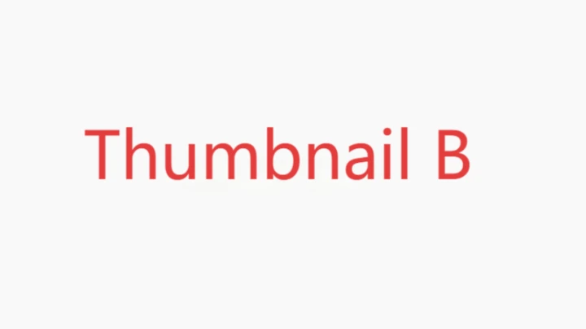

# Thumbnail Tester | Free YouTube Thumbnail Tester

> **Primary Keyword:** thumbnail tester  
> **Secondary Keywords:** YouTube thumbnail tester, thumbnail preview tool, thumbnail comparison, CTR optimization

[](https://www.thumbnailtester.app/)

<!--
  title: Free YouTube Thumbnail Tester – Preview & Compare Thumbnails Before Publishing
  description: Thumbnail Tester is a 100% free online tool that lets creators preview, compare, and optimise YouTube thumbnails for higher click-through rates.
  url: https://www.thumbnailtester.app/
  keywords: thumbnail tester, YouTube thumbnail tester, thumbnail preview, compare thumbnails, CTR optimisation, YouTube tools
-->

## 🔗 Live Demo

Ready to boost your CTR? 👉 **Try Thumbnail Tester now:**[Thumbnail Tester](https://www.thumbnailtester.app/)

---

## Table of Contents

1. [Why Thumbnail Tester?](#why-thumbnail-tester)
2. [Key Features](#key-features)
3. [Quick Start Guide](#quick-start-guide)
4. [Frequently Asked Questions](#frequently-asked-questions)
5. [Contributing](#contributing)
6. [License](#license)

---

## Why Thumbnail Tester?

* **Increase Click-Through Rate (CTR):** Channels that regularly use a *thumbnail tester* report an average **+40 % CTR uplift**.
* **True-to-Life Preview:** See exactly how your thumbnail appears in the latest YouTube layout on desktop, mobile, and tablet.
* **Side-by-Side Comparison:** Upload multiple designs and instantly spot the most eye-catching version.
* **Completely Free:** No sign-up, no limits—start testing in seconds.

> A well-optimised thumbnail can be the difference between viral success and being ignored. **Thumbnail Tester** gives you data-driven confidence before you hit *Publish*.

---

## Key Features

| Feature | Description |
| :--- | :--- |
| 🎯 **Thumbnail Comparison** | Display multiple thumbnails simultaneously to identify the best performer. |
| 👀 **YouTube Feed Preview** | Simulate how your video appears in YouTube Home, Search, and Suggested sections. |
| 📱 **Multi-Device View** | Toggle between desktop, mobile, and tablet mock-ups with one click. |
| ⚡ **Instant Rendering** | Drag & drop your image—previews load in under a second. |
| 🆓 **Forever Free** | Unlimited tests, no hidden fees or subscriptions. |
| 📊 **Title + Thumbnail Test** | Combine different titles with thumbnails to maximise engagement. |

---

## Quick Start Guide

1. **Upload Your Thumbnail**  
   Drag & drop a `JPG` or `PNG` (recommended size **1280 × 720** @ 16:9).
2. **Preview in Context**  
   *Thumbnail Tester* shows real-time previews across devices and YouTube sections.
3. **Compare & Optimise**  
   Evaluate multiple versions, pick the winner, and publish with confidence!

> Try it now ➜ <https://www.thumbnailtester.app/>

---

## Frequently Asked Questions

<details>
<summary><strong>Is Thumbnail Tester really free?</strong></summary>

Absolutely! All features are available without registration or usage limits.

</details>

<details>
<summary><strong>Can I test titles and thumbnails together?</strong></summary>

Yes. After uploading a thumbnail, simply input different titles to preview how they pair together.

</details>

<details>
<summary><strong>What thumbnail dimensions work best?</strong></summary>

YouTube recommends **1280 × 720** pixels (16:9). Larger sizes are also supported, but 16:9 offers the best compatibility.

</details>

---

## Contributing

Got a bug report, feature request, or idea? Open an [issue](https://github.com/suisg/thumbnail-tester/issues) or submit a pull request.

```bash
# Example: clone this repo (front-end source)
git clone https://github.com/suisg/thumbnail-tester
```

---

## License

This project is licensed under the **MIT License**. See the [LICENSE](LICENSE) file for details. 